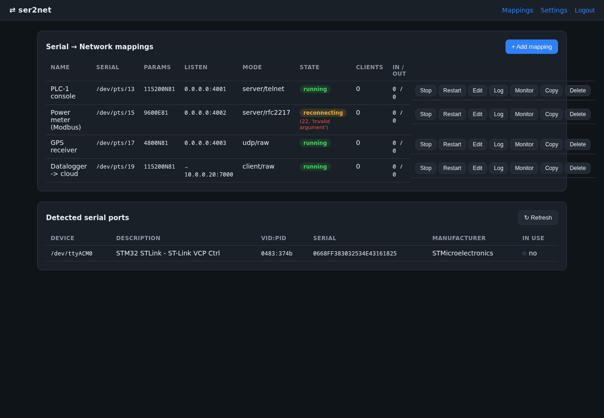
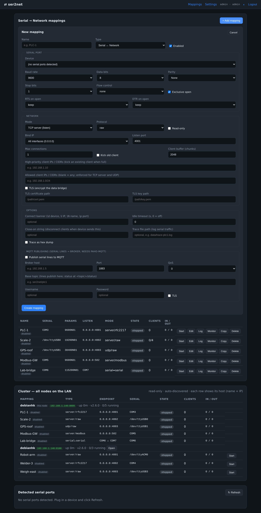
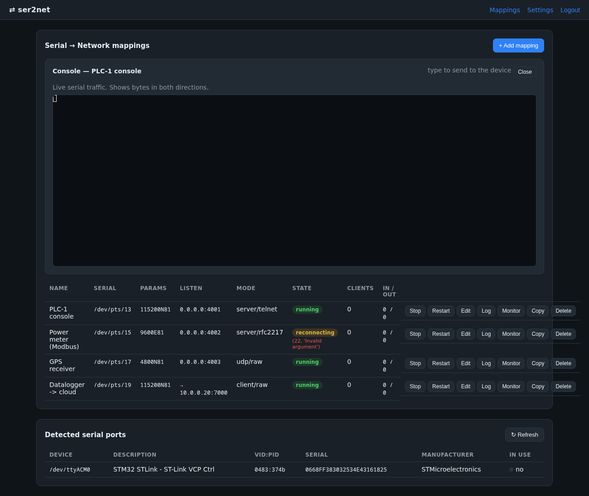
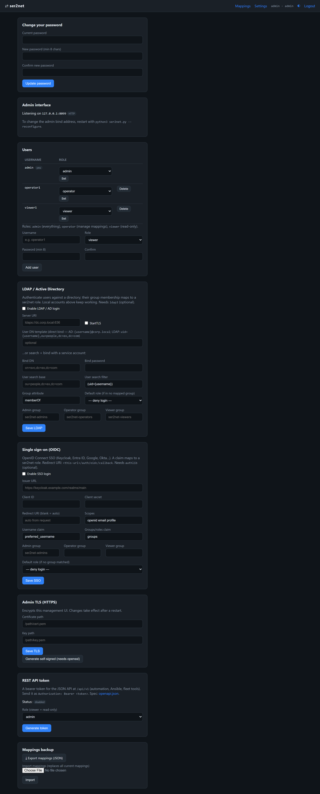
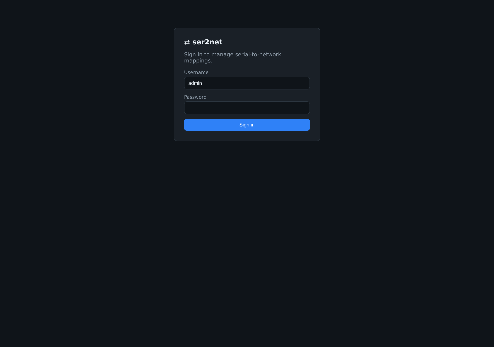

<!-- ser2net — README (English). Türkçe (default): README.md -->

**🌐 [Türkçe](README.md) · [English](README.en.md)**

# ser2net

**A cross-platform (Windows + Linux), pure-Python serial-to-network bridge with a
web management UI** — a modern, web-managed take on the classic `ser2net`. Map dozens
of serial ports (COM / ttyUSB / ttyACM / ttyS) to TCP/UDP endpoints, bidirectionally,
with low latency.

---

## 📸 Screenshots

**Dashboard — dozens of mappings, live status, detected ports:**



| Add mapping (all serial/network options) | In-browser serial console (xterm.js) |
|---|---|
|  |  |

| Settings (password · TLS · backup) | Login |
|---|---|
|  |  |

---

## 📌 Purpose

Industrial devices, PLCs, instruments, GPS/modems, microcontrollers and console ports
usually speak **serial** (RS-232/485/USB-serial). `ser2net` bridges each serial port to
a **TCP/UDP endpoint** so any computer on the network can reach it, and manages
everything from a **password-protected web UI** — no CLI or hand-edited config files.

**Typical use cases:**
- Expose 10+ USB-serial devices attached to one server to networked applications
- Reach SCADA / Modbus-RTU devices from remote clients (raw or RFC2217)
- Network access to device consoles (switches, routers, embedded boards)
- RFC2217 for devices that need remote baud/parity changes
- Bridge two serial ports together (serial↔serial)

---

## ✨ Features

- **Transports:** TCP **server** (listen), TCP **client** (connect-out), **UDP**, and
  **serial↔serial** bridging; optional per-mapping **TLS** for TCP bridges.
- **Protocols:** `raw`, `telnet` (8-bit clean), `rfc2217` (remote live changes to
  baud/parity/data bits/stop bits/flow control).
- **Full serial config:** baud (incl. custom), data/stop bits, parity, flow control
  (none/RTS-CTS/XON-XOFF/DSR-DTR), RTS/DTR on open, exclusive open, RS-485.
- **Live port list:** privilege-free polling + optional event hotplug (Linux pyudev /
  Windows WM_DEVICECHANGE), falling back to polling. **IP picker** from the machine's
  own addresses (localhost / LAN / 0.0.0.0) or custom.
- **Dozens of mappings:** add/edit/delete/start/stop from one screen, with live status.
- **Per-mapping access control:** allowed IP/CIDR list, **high-priority** client IPs
  (a priority client evicts the oldest when the port is full), max connections,
  kick-old-user, read-only, idle timeout, banner, open/close strings, `closeon`.
- **Observability:** per-mapping traffic trace (hex/timestamp), Prometheus `/metrics`,
  config-change audit log, live log viewer, and an in-browser **serial console**
  (xterm.js over WebSocket — watch traffic or type to the device).
- **Security:** password (set on first access, scrypt), CSRF, signed-cookie sessions,
  login rate-limiting, strict security headers, session revocation on password change.
- **REST API:** a JSON API (`/api/v1`) for automation — mapping CRUD, start/stop/restart,
  status and ports; **bearer-token** auth; OpenAPI 3.0 (`/api/v1/openapi.json`). The
  token is generated in Settings.
- **Deployment:** official **Docker** image + `docker-compose`; **systemd** unit;
  Linux+Windows × Python 3.10–3.13 **CI** (GitHub Actions).
- **Fully offline:** all dependencies bundled as wheels; no internet required.

---

## 🧰 Requirements

- **Python 3.10+** installed. Nothing else — dependencies ship in `vendor/wheels/` and
  install to `./lib` on first run (offline).
- Linux: membership in the `dialout` group to **open** serial ports (listing ports
  needs no privilege):
  ```bash
  sudo usermod -aG dialout "$USER"   # then log out/in
  ```
- Windows: no extra privileges for COM ports.
- Optional: `openssl` (self-signed TLS); `pyudev` (Linux) / `pywin32` (Windows) for
  event-driven hotplug — polling is used otherwise.

---

## 🚀 Install & run

```bash
# Linux / macOS
python3 ser2net.py            # or: ./start.sh

# Windows
start.bat
```

On first run:
1. The **console** asks which local IP the admin UI binds to (machine IPs or custom)
   and a port (default 8080). Headless/service default is the safe **127.0.0.1**.
2. Open the printed URL; **set the admin password** on the first screen.
3. From the dashboard, **+ Add mapping**: pick a COM/tty and map it to an IP:port.

Change the bind IP later:
```bash
python3 ser2net.py --reconfigure
```

### Offline install (no-internet machine)
Dependencies live in `vendor/wheels/`; `ser2net.py` installs them to `./lib` on first
launch (`pip install --no-index`). No internet needed. Add wheels for other Python
versions/OSes:
```bash
python3 -m pip download -r requirements.txt -d vendor/wheels \
  --platform win_amd64 --python-version 312 --only-binary=:all:
```

### Docker
```bash
docker compose up -d        # edit the `devices:` line in docker-compose.yml first
# or:
docker build -t ser2net . && docker run -d -p 8080:8080 \
  --device /dev/ttyUSB0 --group-add dialout -v ser2net-data:/data ser2net
```
Inside the container the UI binds to `0.0.0.0` (set via `SER2NET_BIND_IP` /
`SER2NET_PORT` — the interactive picker can't run headless). Details:
[`docs/DOCKER.md`](docs/DOCKER.md).

---

## 🖥️ Usage

- **Add mapping:** name, type (Serial↔Network / Serial↔Serial), serial port +
  parameters, network mode (server/client/udp), protocol, bind/remote IP:port, access
  rules.
- **Start/Stop/Restart/Copy/Delete:** per row.
- **Log:** the mapping's history (newest first, persists across restarts).
- **Monitor:** live serial terminal in the browser (xterm.js); type to the device on
  network mappings.
- **Settings:** change password, admin TLS (provide paths or generate self-signed),
  generate/revoke the **REST API token**, mappings **backup/restore** (JSON), status.
- **/metrics:** Prometheus-format metrics (authenticated).

---

## 🔌 REST API

Alongside the browser UI, a JSON API at `/api/v1` for automation. Authenticate with
`Authorization: Bearer <token>`; generate the token under **Settings → REST API token**
(shown only once). Full description: `GET /api/v1/openapi.json`.

```bash
TOKEN="s2n_..."   # generated in Settings
# all mappings (config + live status)
curl -H "Authorization: Bearer $TOKEN" http://HOST:8080/api/v1/mappings
# create a mapping
curl -X POST -H "Authorization: Bearer $TOKEN" -H "Content-Type: application/json" \
  -d '{"name":"PLC-1","kind":"net","serial":{"port":"/dev/ttyUSB0","baudrate":9600},
       "network":{"mode":"server","bind_ip":"0.0.0.0","port":4001}}' \
  http://HOST:8080/api/v1/mappings
# start / stop / restart
curl -X POST -H "Authorization: Bearer $TOKEN" http://HOST:8080/api/v1/mappings/<id>/stop
```
Endpoints: `GET/POST /mappings`, `GET/PUT/DELETE /mappings/{id}`,
`POST /mappings/{id}/{start|stop|restart}`, `GET /status`, `GET /ports`,
`GET /health` (unauthenticated), `GET /openapi.json`.

---

## 🔒 Security

The UI is **always password-protected** and binds to **127.0.0.1** by default.
Exposing it to the network requires an explicit IP choice at startup and warns when
bound without TLS. For LAN deployments, use TLS (`admin_ui.tls_*`) and per-mapping
`allowed_client_ips`. Raw TCP is plaintext — be careful on untrusted networks. A bare
`0.0.0.0`/`::` in an allow/priority list means "any client".

---

## ⚙️ Run as a service

- **Docker:** official `Dockerfile` + `docker-compose.yml` (see above and
  [`docs/DOCKER.md`](docs/DOCKER.md)) — `restart: unless-stopped`, `/data` volume.
- **Linux (systemd):** `systemd/ser2net.service` — a dedicated unprivileged user,
  `SupplementaryGroups=dialout`, `Restart=on-failure`, hardening directives.
  **Do not run as root.**
- **Windows:** wrap with [Shawl](https://github.com/mtkennerly/shawl).

---

## 🗂️ Configuration & state files

All state lives in the **data dir** (default `data/`):
- `config.json` — admin IP, password hash, all mappings (atomic write; owner-only
  perms: 0600 on POSIX, `icacls` owner/SYSTEM/Administrators on Windows).
- `all.log` — global activity/audit; `audit.log` — config changes.
- `logs/<id>.log` — per-mapping history (hourly maintenance: trimmed >15 days / >100 MB).
- `tls/` — certificate/key if self-signed is generated.

Deleting `config.json` + `all.log` fully resets the system (orphan logs auto-pruned).

---

## 🧪 Testing

Unified test runner — the portable suite (no hardware, no socat) runs on every OS:
```bash
python3 tests/run_all.py            # portable suite (Windows + Linux)
python3 tests/run_all.py --socat    # + socat-based data-path tests (Linux)
```
The socat tests use virtual serial ports (Linux); no hardware needed. Individual
files still run directly, e.g. `python3 tests/test_rest_api.py`. CI (GitHub Actions)
runs ruff lint + the full matrix (ubuntu/windows × Python 3.10–3.13).

---

## 📜 License

**Commercial / proprietary** — see [`LICENSE`](LICENSE). All rights reserved; no use,
distribution or resale without a valid commercial license. Bundled third-party
components keep their own (permissive) licenses — see
[`THIRD-PARTY-NOTICES.md`](THIRD-PARTY-NOTICES.md). Contact: haliskilic90@gmail.com

Roadmap: [`ROADMAP.md`](ROADMAP.md) · Türkçe: [`README.md`](README.md)
